このプロジェクトの README は日本語と韓国語で提供されています。
<br>
本プロジェクトの README は、日本語および韓国語で提供されています。

- [日本語 (Japanese)](README.md)
- [한국어 (Korean)](README_kr.md)

# GSC Portal Web

GSC Portalは、永進専門大学校グローバルシステム融合科の学生・教授・管理者を対象に、  
それぞれの役割に応じて日程や関連情報を統合管理できるプラットフォームです。

## プロジェクト背景

本プロジェクトは、**「学校生活に関するすべての情報を一目で管理したい」** という学生のニーズから開発されました。  
従来、学校からのお知らせは主にKakaoTalkを通じて伝達されており、以下のような問題がありました。

1. **情報の分散**  
   学年や語学クラスなど、各学生が自分に該当するお知らせや時間割を確認する必要があり、非常に手間がかかっていた。
2. **重要な連絡の見落とし**  
   急な休講・補講などのスケジュール変更が十分に伝わらず、見落としてしまうケースもありました。
3. **データの期限切れ**  
   時間が経つと過去のお知らせや添付ファイルを再確認できず、後から学習する際に不便でした。

本サービスを通じて、学生は自分のレベルに合った時間割をすぐに確認でき、過去のお知らせもいつでも簡単に検索・閲覧できるようになります。

## 目標

- **パーソナライズされた情報提供**  
  ユーザーの所属（学年・言語）を判別し、必要な情報のみを表示する仕組みを目指します。
- **統合管理プラットフォーム**  
  分散していた学事管理機能を一元化し、管理効率の最大化を図ります。

## Members

<table>
  <tr>
    <td align="center">
      <br/>
      <b>キム・ソンシク</b><br/>
      Backend（リーダー）<br/>
      <a href="https://github.com/Gapsick">@Gapsick</a>
    </td>
    <td align="center">
      <br/>
      <b>キム・ソングァン</b><br/>
      Backend<br/>
      <a href="https://github.com/ias-kim">@ias-kim</a>
    </td>
    <td align="center">
      <br/>
      <b>クォン・ヒョギル</b><br/>
      Frontend<br/>
      <a href="https://github.com/kwonhyukil">@kwonhyukil</a>
    </td>
    <td align="center">
      <br/>
      <b>大井彩夢</b><br/>
      Frontend<br/>
      <a href="https://github.com/ohiayame">@ohiayame</a>
    </td>
  </tr>
</table>

## 技術スタック

### Frontend

- フレームワーク：Vue 3
- 状態管理：Pinia
- CSS フレームワーク：Tailwind CSS

### Backend

- Express.js
- DB：MySQL  
  （ <a href="https://github.com/gsc-lab/cs25-2-gsc-portal-api">Backend Repository</a> ）

<hr style="height:3px; background:#444; border:none;" />

## 機能一覧

### 1. ログイン / 会員登録

担当：クォン・ヒョギル

- Google OAuth を利用したログイン
- 認証完了後、会員登録ページへリダイレクト
- ユーザーのステータスに応じたページ遷移

| ログイン（Google OAuth）                             | 会員登録ページ                                             |
| ---------------------------------------------------- | ---------------------------------------------------------- |
| 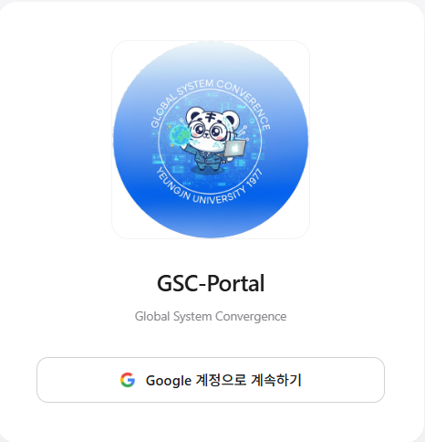 | 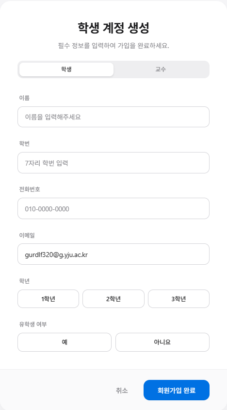 |

| 会員登録完了                                                   | 承認 / 拒否                                                                      |
| -------------------------------------------------------------- | -------------------------------------------------------------------------------- |
| 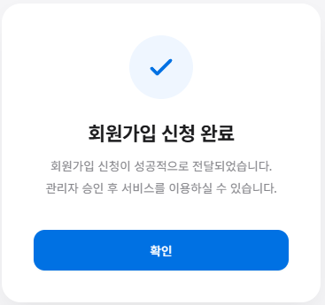 | 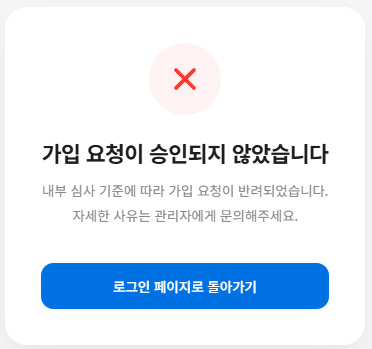 |

<hr style="height:3px; background:#444; border:none;" />

### 2. メイン画面

担当：クォン・ヒョギル

- 時間割、お知らせ、清掃、教室投票状況を一覧で表示

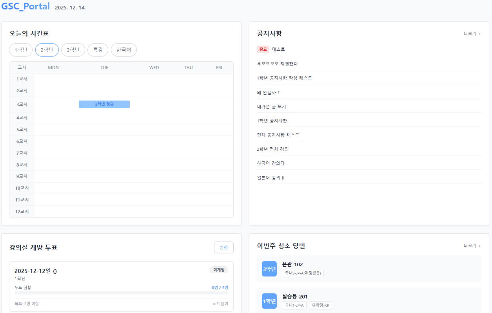

<hr style="height:3px; background:#444; border:none;" />

### 3. お知らせ

担当：クォン・ヒョギル

- 条件に応じたお知らせのフィルタリング
- 教授・管理者：学年／タイプ／科目別のお知らせ作成
- 編集・削除は作成者のみ可能

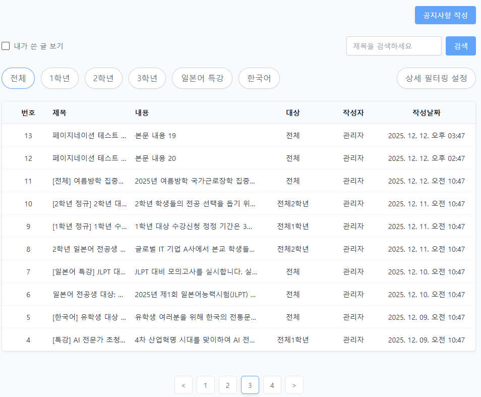

| お知らせ作成                                                       | お知らせ編集                                                   |
| ------------------------------------------------------------------ | -------------------------------------------------------------- |
| 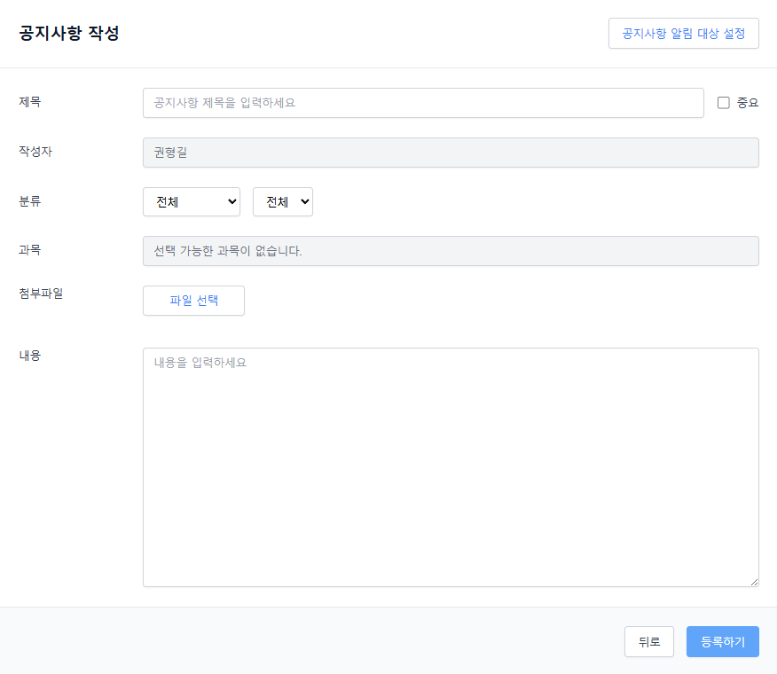 | 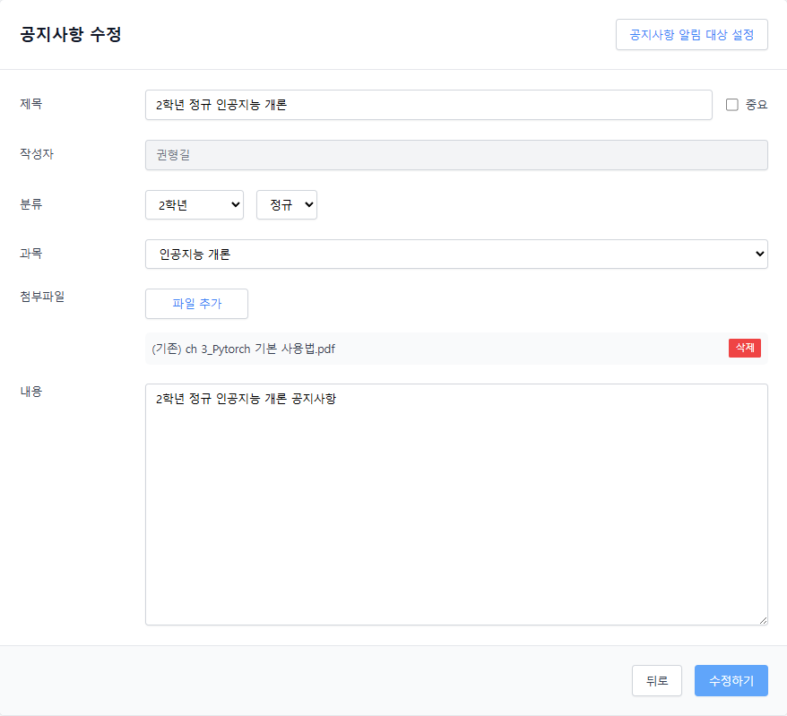 |

<hr style="height:3px; background:#444; border:none;" />

### 4. 時間割

担当：大井　　

- 正規時間割、日本語特講、休講・補講情報を一つの時間割で確認可能

**管理者機能**：  
講義 CRUD、時間割 CRUD、休講・補講 CRUD、クラス分け登録、相談登録

| 時間割                                       | サイドバー                                          |
| -------------------------------------------- | --------------------------------------------------- |
| 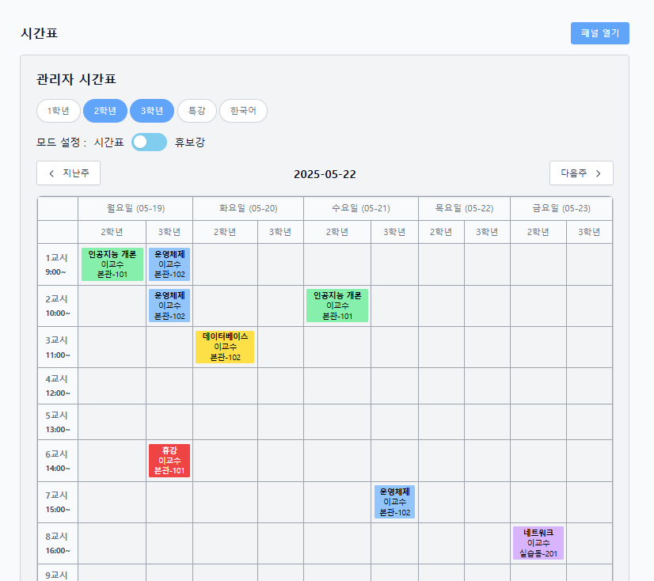 | 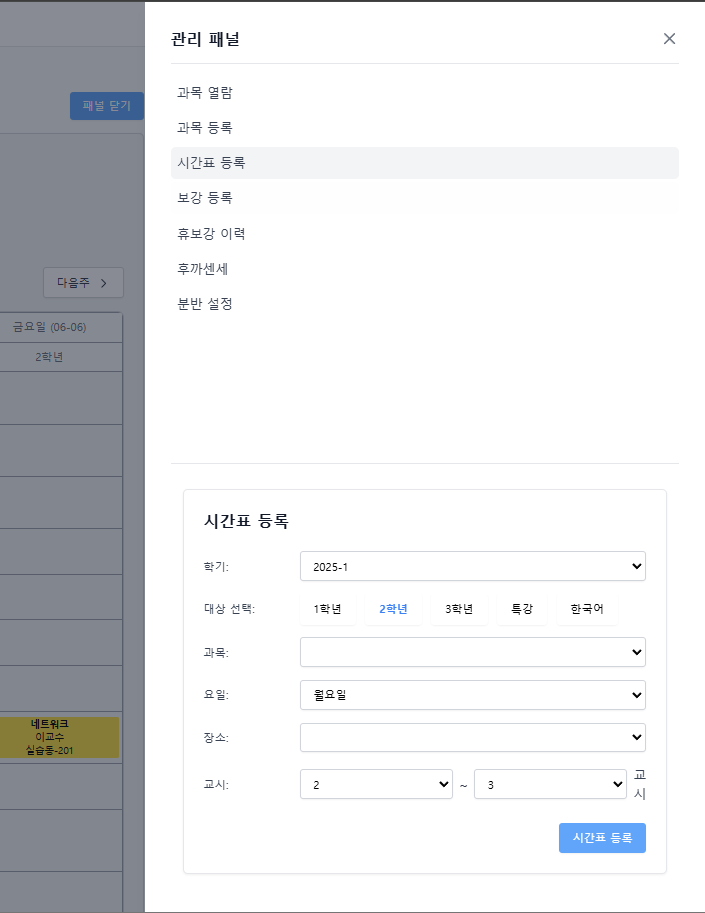 |

<hr style="height:3px; background:#444; border:none;" />

### 5. 清掃

担当：クォン・ヒョギル

- 管理者が条件を指定してロスターを作成
- ロスターはバックエンドでランダム自動生成

| 清掃担当確認                                | 清掃設定                                          |
| ------------------------------------------- | ------------------------------------------------- |
| 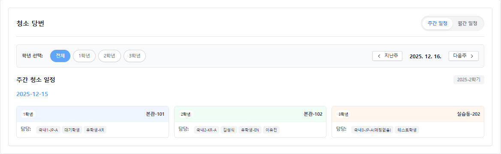 | 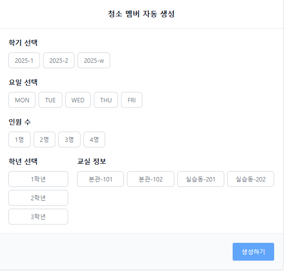 |

<hr style="height:3px; background:#444; border:none;" />

### 6. 教室

担当：大井  
**機能 1**：ハードウェア実習室などの学生が自由に利用可能な教室の使用予約  
**機能 2**：学年別の週末開放申請（管理者／教授：人数制限設定）

| 教室予約                                     | 週末開放申請                                  |
| -------------------------------------------- | --------------------------------------------- |
| 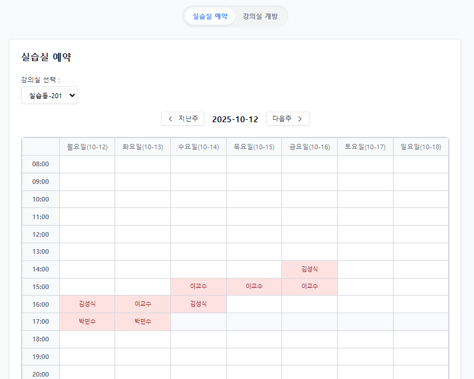 | 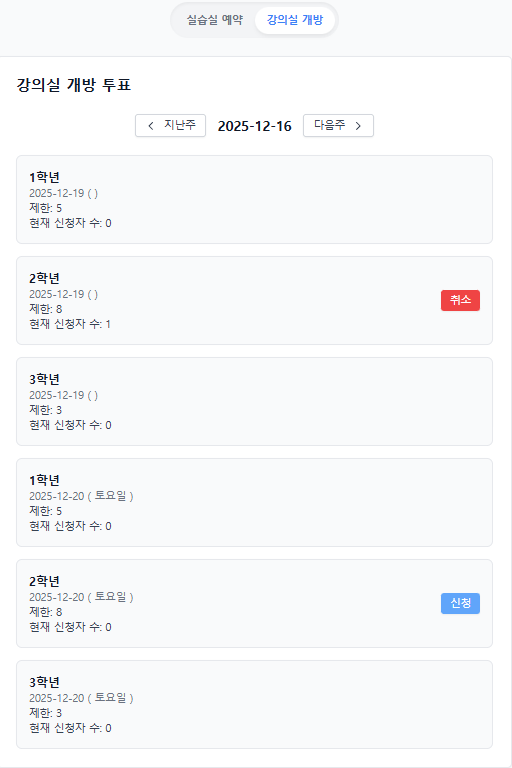 |

<hr style="height:3px; background:#444; border:none;" />

### 7. プロフィール

担当：クォン・ヒョギル

- プロフィール情報の確認
- 試験成績の入力・閲覧

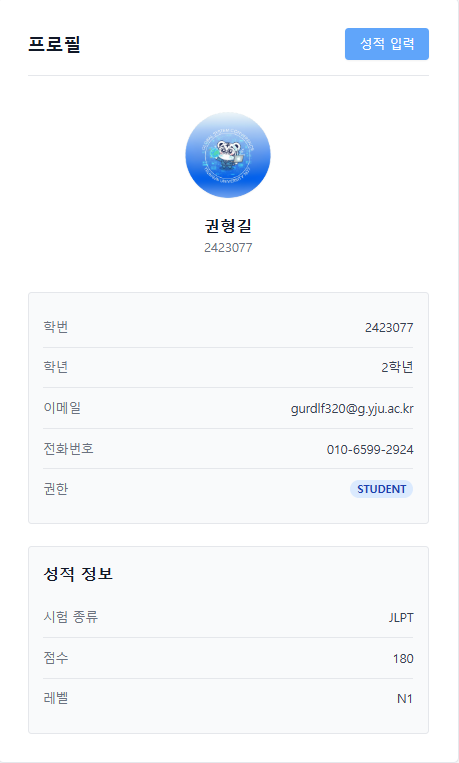

<hr style="height:3px; background:#444; border:none;" />

### 8. 管理者

担当：大井  
**機能**：ユーザー承認、外部メール登録、学期／教室管理、ユーザー管理  
**対象**：管理者／教授

| ユーザー承認                             | ユーザー管理                              |
| ---------------------------------------- | ----------------------------------------- |
| 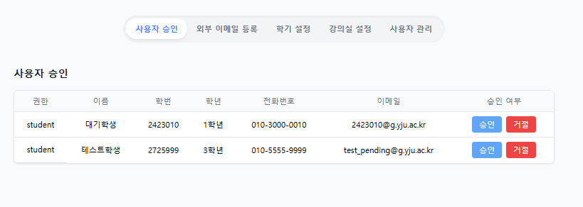 | 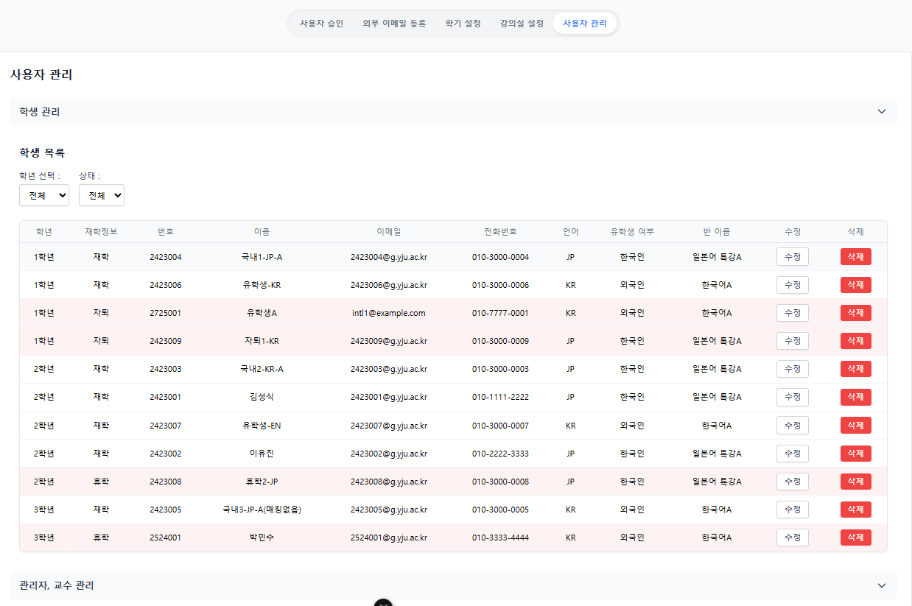 |

<hr style="height:3px; background:#444; border:none;" />

## コミット規約

- ✨ feat：新機能追加
- 🐛 fix：バグ修正
- 📚 docs：ドキュメント修正
- 💅 style：CSS 関連
- ♻️ refactor：リファクタリング
- 🔧 chore：その他雑務

<hr style="height:3px; background:#444; border:none;" />

## プロジェクト構成

```
src/
├─ api/ # API 通信
├─ layouts/ # 共通レイアウト
├─ pages/ # 各ページ
|     ├─ Admin/      # 管理者ページ
|     ├─ Classroom/  # 教室 予約・申請ページ
|     ├─ Cleaning/   # 掃除ページ
|     ├─ Login/      # ログインページ
|     ├─ Main/       # メインページ
|     ├─ NotFound/   # エラーページ
|     ├─ Notice/     # お知らせページ
|     ├─ Profile/    # プロフィールページ
|     ├─ Register/   # 新規登録ページ
|     └─ TimeTable/  # 時間割ページ
├─ router/ # Vue Router 設定
├─ stores/ # Pinia 状態管理
├─ styles/ # 共通スタイル
├─ App.vue
└─ main.js
```
